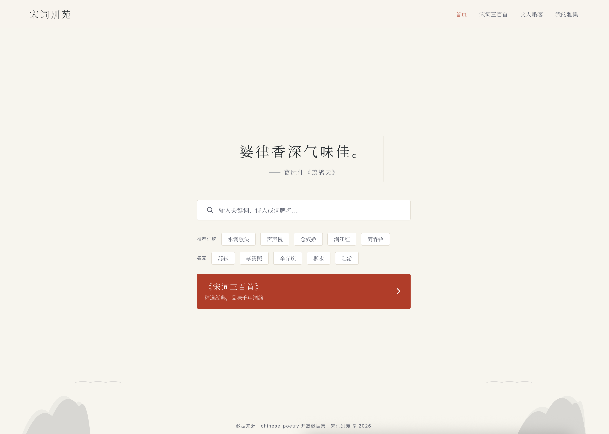
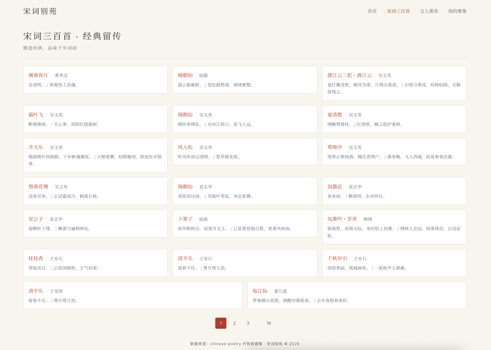
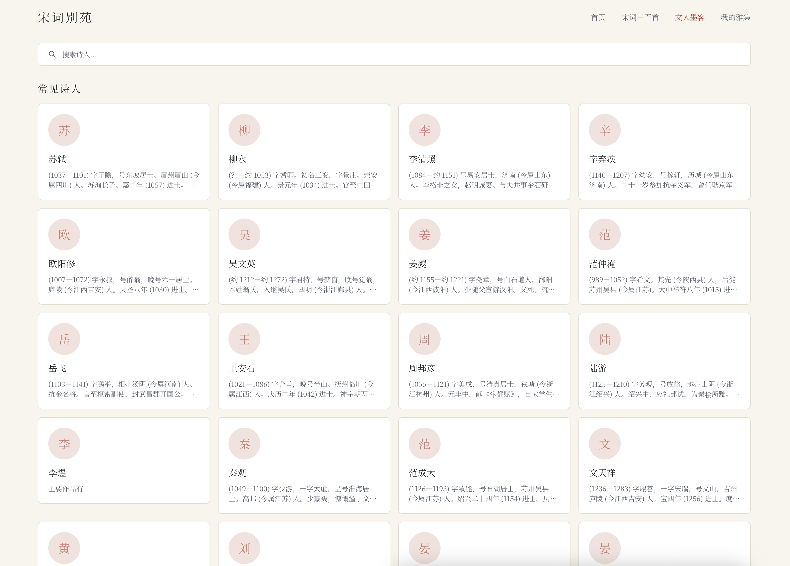
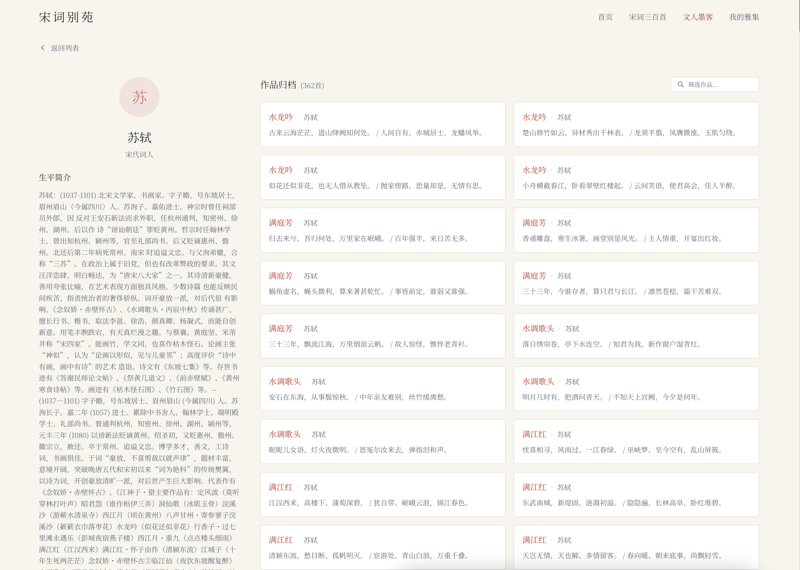
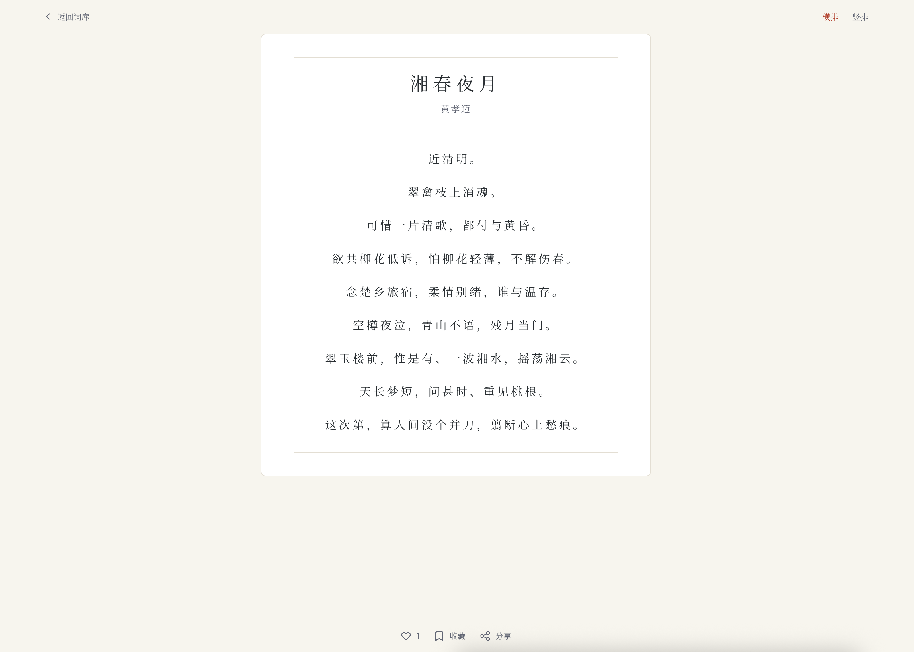
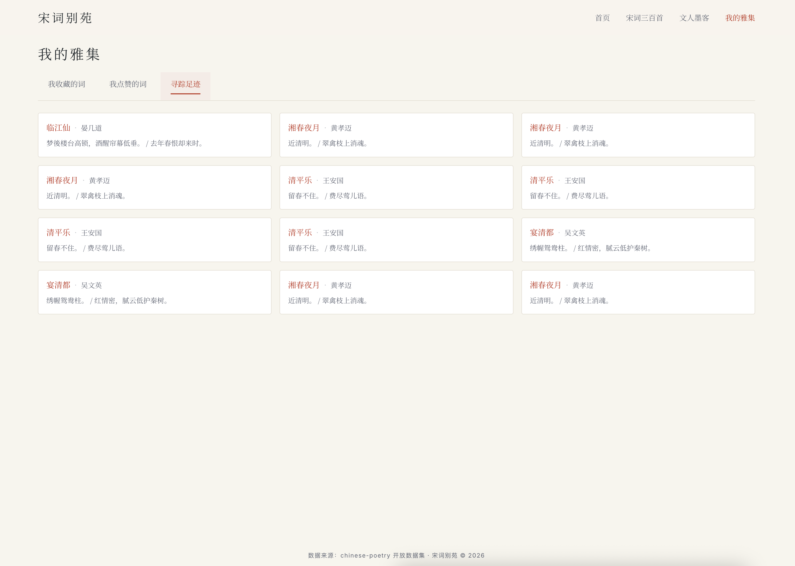

# 宋词别苑 (Song Ci Pavilion)

一个兼具中国传统美学与现代高可用架构的宋词沉浸式平台。支持全量宋词智能检索、三百首精选词作浏览、诗人档案归档，以及个性化收藏与点赞。

## 界面预览

### 首页 — 智能搜索与每日一词


### 宋词三百首 — 经典精选卡片流


### 诗人列表 — 常见诗人网格


### 诗人详情 — 生平简介与作品归档


### 词作详情 — 沉浸式阅读


### 我的雅集 — 收藏、点赞与浏览历史


---

## 技术架构

```
┌─────────────────────────────────────────────────┐
│                   Frontend                       │
│        React (Vite) + Tailwind CSS + TS          │
└──────────────────────┬──────────────────────────┘
                       │ REST API
┌──────────────────────▼──────────────────────────┐
│                   Backend                        │
│          Go + Gin (API Gateway)                  │
└───────┬──────────────┬──────────────────────────┘
        │              │
   ┌────▼────┐   ┌─────▼─────┐
   │  MySQL  │   │   Redis   │
   └─────────┘   └───────────┘
```

| 层级 | 技术选型 |
|------|----------|
| 前端 | React 18 + Vite 5 + TypeScript + Tailwind CSS 3 + Zustand + Axios |
| 后端 | Go 1.26 + Gin + JWT (golang-jwt) + godotenv |
| 数据库 | MySQL (持久化用户、词作、诗人、收藏) |
| 缓存 | Redis (Session/Token、搜索缓存、点赞计数) |

---

## 项目结构

```
poetry/
├── CLAUDE.md                  # 项目详细规格说明
├── README.md                  # 本文件
├── images/                    # 界面截图
├── poetry-service/            # Go 后端服务
│   ├── main.go                # 入口：Gin 路由注册、CORS 配置
│   ├── init.sql               # MySQL 建表与种子数据
│   ├── config/                # 配置加载（MySQL/Redis/JWT）
│   ├── common/                # 数据库连接、统一响应
│   ├── middleware/            # JWT 鉴权中间件
│   ├── handler/               # HTTP 处理器
│   ├── service/               # 业务逻辑层
│   └── model/                 # 数据模型
└── poetry-web/                # React 前端
    ├── src/
    │   ├── api/               # Axios API 客户端
    │   ├── store/             # Zustand 状态管理
    │   ├── pages/             # 页面组件
    │   ├── components/        # 通用组件
    │   └── utils/             # 工具函数
    ├── vite.config.ts
    └── tailwind.config.js
```

---

## 快速开始

### 前置依赖

- **Go** >= 1.21
- **Node.js** >= 18
- **MySQL** >= 8.0
- **Redis** >= 6.0

### 1. 初始化数据库

```bash
# 登录 MySQL 后执行
source poetry-service/init.sql
```

### 2. 配置环境变量

在 `poetry-service/` 下创建 `.env` 文件：

```env
DB_HOST=127.0.0.1
DB_PORT=3306
DB_USER=root
DB_PASSWORD=your_password
DB_NAME=poetry-app

REDIS_ADDR=127.0.0.1:6379
REDIS_PASSWORD=
REDIS_DB=0

JWT_SECRET=your-secret-key
```

### 3. 启动后端

```bash
cd poetry-service
go run main.go
# 监听 http://localhost:8080
```

### 4. 启动前端

```bash
cd poetry-web
npm install
npm run dev
# 监听 http://localhost:3000
```

前端 Vite 已配置代理，`/api` 请求自动转发至后端 `localhost:8080`。

---

## 功能页面

| 页面 | 路由 | 说明 |
|------|------|------|
| 首页 | `/` | 每日一词、智能搜索框、推荐词牌/名家、宋词三百首入口 |
| 宋词三百首 | `/three-hundred` | 300 首精选词作卡片流，支持分页 |
| 文人墨客 | `/poets` | 诗人网格列表 + 诗人详情（生平 + 作品归档） |
| 我的雅集 | `/my-collection` | 收藏 / 点赞 / 浏览历史（需登录） |
| 账号中心 | `/auth` | 登录 / 注册 / 忘记密码 |

---

## API 概览

所有接口位于 `/api/v1` 前缀下。

### 公开接口

| 方法 | 路径 | 说明 |
|------|------|------|
| POST | `/auth/register` | 邮箱注册 |
| POST | `/auth/login` | 邮箱登录 |
| POST | `/auth/forgot-password` | 忘记密码 |
| POST | `/auth/send-code` | 发送验证码 |
| GET | `/poetry/search` | 宋词搜索（关键词 / 诗人 / 词牌名） |
| GET | `/poetry/three-hundred` | 宋词三百首（分页） |
| GET | `/poetry/daily-quote` | 每日一词 |
| GET | `/poetry/:id` | 词作详情 |
| GET | `/poets` | 诗人列表 |
| GET | `/poets/:id` | 诗人详情及其作品 |

### 需鉴权接口（Bearer Token）

| 方法 | 路径 | 说明 |
|------|------|------|
| GET | `/user/profile` | 获取当前用户信息 |
| POST/DELETE | `/interaction/like` | 点赞 / 取消点赞 |
| POST/DELETE | `/interaction/favorite` | 收藏 / 取消收藏 |
| GET | `/interaction/likes` | 我的点赞列表 |
| GET | `/interaction/favorites` | 我的收藏列表 |
| POST | `/interaction/history` | 记录浏览历史 |
| GET | `/interaction/history` | 获取浏览历史 |

---

## 数据库设计

`init.sql` 包含完整建表语句与种子数据，共 8 张表：

| 表名 | 说明 |
|------|------|
| `authors` | 宋代诗人（姓名、简介、代表作） |
| `poems` | 全量宋词（作者、词牌名、词作段落） |
| `three_hundred_poems` | 宋词三百首精选 |
| `users` | 用户账户（邮箱、密码哈希、昵称、头像） |
| `verification_codes` | 邮箱验证码 |
| `favorites` | 用户收藏（支持 poems / three_hundred_poems） |
| `likes` | 用户点赞 |
| `browse_history` | 浏览历史 |

---

## 设计风格

采用中国传统宣纸美学，核心色板：

- **背景**: `#F9F6F0` (宣纸色)
- **强调色**: `#C93726` (朱红)
- **边框**: `#E8E2D8` (淡墨线)
- **字体**: Noto Serif SC / Source Han Serif SC / Playfair Display

---

## 数据来源

宋词数据来自 [chinese-poetry](https://github.com/chinese-poetry/chinese-poetry) 开源数据集。

## License

MIT
